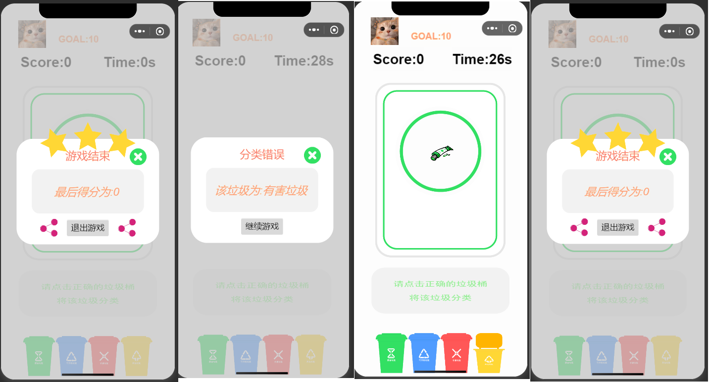

# README

# 1 Introduce

​		随着社会的快速发展，垃圾存量急剧上升，“垃圾围城”、“垃圾围村”正 日益成为困扰中国各个城市、乡村的难解之题。垃圾分类是社会进步和生态文明 的标志，是人人均可参与其中来保护环境和改善环境的方式。 

​		为深入贯彻习近平总书记关于生活垃圾分类的重要批示指示精神，落实党中 央、国务院决策部署要求，统筹推进“十四五”城镇生活垃圾分类和处理设施建 设工作，加快建立分类投放、分类收集、分类运输、分类处理的生活垃圾处理系 统，国家发展改革委、住房城乡建设部组织编制了《“十四五”城镇生活垃圾分 类和处理设施发展规划》--2021 年 5 月 6 日。 

​		目前，中国已经将北京、天津、上海、重庆、郑州等 46 个城市作为垃圾分 类重点城市，陆续开始严格实行垃圾分类投放。但垃圾分类依旧面临很大的问题， 例如居民对垃圾分类的意识依旧较为浅薄，很多人不了解垃圾分类，不清楚垃圾 分类标准，甚至有人认为这是没有用的事情。不仅仅是居民，相关部门和政府缺 乏完整的体系，虽然出台了一些相关政策并落实，但依旧没有全面实施，还需要 长久的努力

​		可以通过在线小游戏或小程序等形式引导教育公众参 与垃圾分类和处理，充分用信息化寓教于乐的方式宣传普及生活垃圾分类知识， 多渠道持续提升居民生活垃圾分类意识，引导居民养成垃圾分类习惯。

​		该项目设计了一个简单的垃圾分类趣味小游戏。

# 2 Usage

* 项目编写使用了Cocos Creator游戏引擎打造小游戏，并构建成微信小程序的形式发布，游戏素材存放于服务器，只涉及一个与服务器的交互：保留用户当前最高分；后端使用Django实现，接口已经放在了服务器；
* 为了运行项目，你可能需要：
  * 安装Cocos Creator引擎：
    * 这是非必要的，如果你需要对项目进行修改，那么必须要通过游戏编辑器来操作，无法在微信开发者工具中进行；
    * [Cocos Creator](https://www.cocos.com/)
    * 项目中使用的编辑器版本是2.3.2
  * 安装微信开发者工具：
    * 这是必要的，对于小程序和小游戏项目的导入，都是使用这个工具；
    * [微信开发者工具](https://open.weixin.qq.com/)
  * 了解JavaScript语言

* 导入项目：
  * 方式一：使用cocos creator导入：
    * 仅需要将整个文件夹看做成为一个项目导入即可；
  * 方式二：使用微信开发者工具导入：
    * 将目录`CleanGarbage\build\wechatgame`下的wechatgame作为一个Minigame项目导入即可；
  * 导入项目注意事项：
    * 你可能需要一个appid，如果你仅需要预览整个项目，那么也需要一个临时的appid，请在申请appid的时候，选择服务类型为小游戏；
    * 你可能需要将代码中需要请求服务器的域名设置为小程序合法请求域名（request是必要的，其余都非必要）
    * 完成以上操作你都需要前往微信公众平台进行操作：[微信公众平台](https://mp.weixin.qq.com/)

# 3 部分游戏页面

# 4 说明

* 项目中的游戏素材为合作的同学设计，项目仅作为学习交流使用；
* 有任何问题可以留言；
